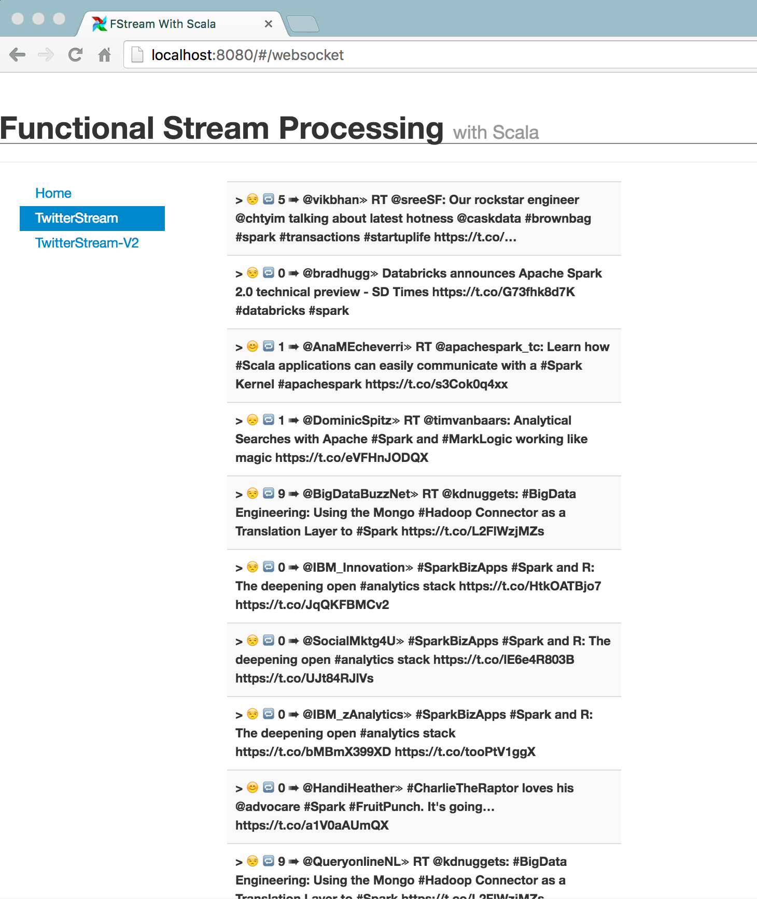
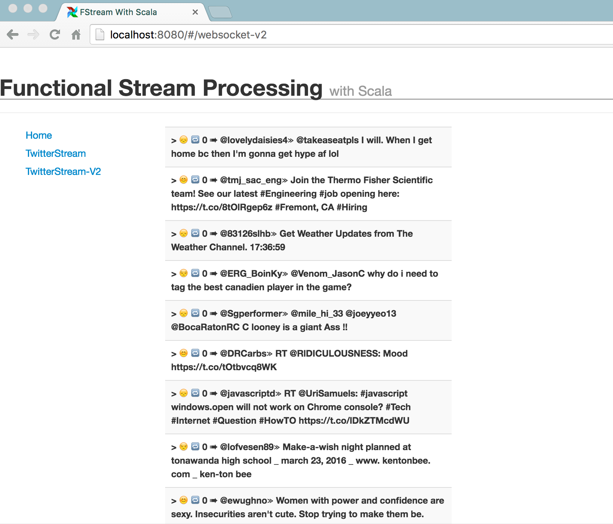

# Functional Stream Processing with Scala 

This repository contains the artefacts of the talk **Functional Stream Processing with Scala** at ScalaItaly 2016.

Primary objective of this talk was to introduce Scalaz-Stream and discuss its key goals, design philosophy and core building block, Process and its semantics. 

Slides of the talk is available [here](./ adilakhter-scalaz.pdf). Credits for the images used in slides: [Mario Sixtus]( https://www.flickr.com/photos/sixtus/).


## Code

To get started the examples demonstrated. 

```
$ git clone https://github.com/adilakhter/scalaitaly-functional-stream-processing.git
$ cd scalaitaly-functional-stream-processing
$ sbt 
> restart
```
It will start running the Demo Application (a Http4s based service) in http://localhost:8080.


In this talk, we presented two examples.

### Example 1

In the first example, in every N seconds, we are getting tweets from Twitter. Then, several transformations have been performed on it. Finally, we are connecting the stream to two sinks: A websocket endpoint built using Http4s and also a `io.stdPrintLine` sink.

If we run the application and initiate the websocket request, we can see the live stream from twitter: 




### Example 2

In the first example, we have created the source from scratch. But in real world cases, there may be an existing stream of data that we have use as a source. 

Hence, in the second example, instead of building a source from scratch, we have used an existing stream, via Twitter’s Streaming API and similarly performed the sentiment analysis and connected it to the websocket endpoint. 



Disclaimer: Note that these examples are for the demonstration purpose only. Using them in production system would require some careful consideration. 


## References and Further Readings

1.  Scalaz-Stream Masterclass by Runar at [NE Scala 2016]( https://www.youtube.com/watch?v=o3Siln85TJ4).
2.  [Scalaz Task - the missing documentation]( http://timperrett.com/2014/07/20/scalaz-task-the-missing-documentation/)
3.  [scalaz-stream User Notes]( https://aappddeevv.gitbooks.io/test_private_book/content/basics/intro_basics.html)
4.  [Comparing akka-stream and scalaz-stream with code examples]( https://softwaremill.com/comparing-akka-stream-scalaz-stream/)
5.  https://github.com/functional-streams-for-scala/fs2/wiki/Additional-Resources


